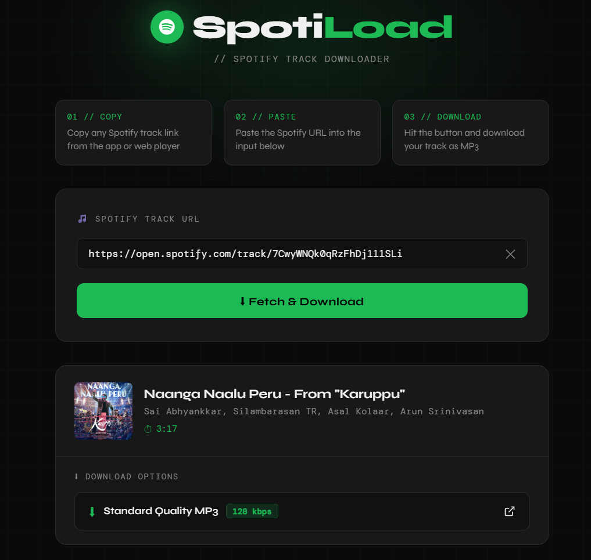

<p align="center">
  
</p>

<h1 align="center">🎵 SpotiLoad</h1>
<p align="center">
  <b>Spotify Track Downloader 🚀</b><br>
  Download your favorite tracks as MP3 easily
</p>

<p align="center">
  
  
  
</p>

---

## ✨ Features

- 🎧 Fetch Spotify track details  
- 🖼️ Album art preview  
- ⏱ Track duration display  
- ⬇ Download MP3 instantly  
- ⚡ Fast & clean UI  

---


## 📸 Preview

<p align="center">
  
</p>
---

## 🚀 Getting Started

### 1️⃣ Clone the repo
```bash
git clone https://github.com/Logesh-07-cyber/Spotiload.git
cd Spotiload

---

## 👨‍💻 Connect with me

<p align="center">
  <a href="https://www.linkedin.com/in/k-logesh-prasanna-ba3b703a9/">
    
  </a>
  <a href="https://github.com/Logesh-07-cyber">
    
  </a>
</p>